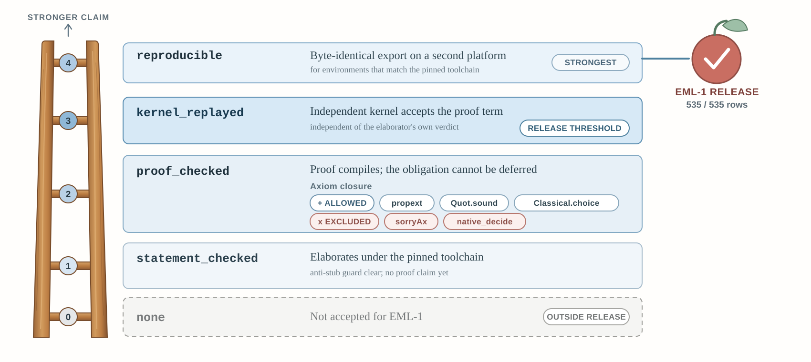
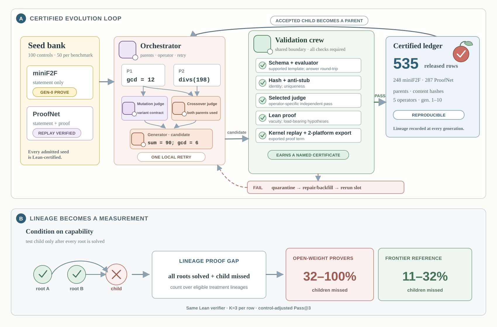

<h1>EntropyMaLean</h1>

<p><i>A Lean-certified corpus of generated theorem-proving problems, and the pipeline that made it.</i></p>

<p>
  
  
  
  
</p>

Every released row is a theorem with a proof that compiles. Every row that did
not make it ships too, with the reason it was refused — a corpus that shows only
its survivors cannot be checked.

<p align="center">
  
</p>

**All 535 rows reach `reproducible`** — the top rung, and the one released
benchmarks most often skip. An independent kernel accepted an exported proof term
it did not produce, and a second platform regenerated that export byte for byte,
under the same toolchain and the same package revisions.

We measured what skipping it costs: **a third of ProofNet-Verified does not
compile under our pin, despite shipping as verified.** Those checks were not
wrong. They were local, and nothing in the artifact said what local meant.

---

## Where to start

|   |   |
|---|---|
| **[Browse the corpus →](site/workspace.html)** | Every row with its Lean, its certificate, and the reasoning behind each judgement — including the passes that disagreed |
| **[`REVIEWERS.md`](REVIEWERS.md)** | How to reproduce any of it, ordered by cost. The first section needs nothing but Lean |
| **[`scripts/INVENTORY.md`](scripts/INVENTORY.md)** | What each of the 101 scripts is for, and why it sits where it does |

<details>
<summary><b>Seeing how each model worked through a problem</b></summary>

<br>

Pass@3 says a model solved a problem or did not. It does not say whether the
model was one identifier away or never produced a proof body — and the episodes
kept the difference: every attempt carries Lean's verdict on it.

Those traces are 19 MB across 636 files — 13 models over 24,765 episodes — so
they are served beside the page rather than bundled into it. Serve this
repository and they appear under every row:

```bash
python3 -m http.server 8000     # then open site/workspace.html
```

</details>

---

## The corpus

|   |   |
|---|---|
| Released | **535** — 287 from ProofNet, 248 from miniF2F |
| Refused by the validation layer | **691**, each with the reason |
| Excluded by the evaluation preamble | **2** — sound and certified, but their statements do not parse there |
| Candidates judged | **1,228** |

The three parts ship separately so the arithmetic can be checked rather than
taken. Those last two both compile under their own header and cleared the kernel
replay; what they fail is the exam preamble, which opens `Nat` and so binds `φ`
before their statements can use it as a binder.

```
data/release/eml1_release.jsonl             the corpus, one JSON object per line
data/release/eml1_rejected.jsonl            691 refusals, with reasons
data/release/eml1_preflight_excluded.jsonl  2 sound rows the harness cannot parse
data/release/CAMPAIGN_LABELS.md               what run-a … run-e mean
data/benchmarks/                              the two 50-row seed sets
examples/seeds/                               a five-seed group — the input a campaign takes
docs/eml1_release_report*.pdf               every row as a card, 1,177 pages
```

---

## How a row is made, and what it has to survive

<p align="center">
  
</p>

A seed is an existing benchmark problem with a proof that compiles here. An
operator mutates one seed or crosses two. The child is kept only if it survives
every check that applies to it — **and the checks are the point, not the
generator.**

A generated theorem can be sound Lean and still be worthless. It can be true
because nothing satisfies its hypotheses; it can restate something the corpus
already holds; it can follow from a parent outright; and it can prove something
other than the problem its prose describes. None of these is visible to a type
checker, and no two are the same kind of question — so each goes to the faculty
that can settle it.

| Directory | The question | Who settles it |
|---|---|---|
| [`faithfulness/lean/`](scripts/faithfulness/lean) | Are the hypotheses satisfiable? Is every one load-bearing? Does a parent already prove this? | **Lean**, as a compilation whose outcome *is* the verdict |
| [`faithfulness/identity/`](scripts/faithfulness/identity) | Is this the same theorem as another row? | **A hash** over the alpha-normal form, against every earlier run |
| [`faithfulness/reader/`](scripts/faithfulness/reader) | Does the child demand reasoning its parent's proof does not supply? Does the prose describe the goal Lean elaborated? | **A model, asked twice** — admission needs both |
| [`faithfulness/kernel/`](scripts/faithfulness/kernel) | Does it hold for someone who is not us? | **A kernel that did not write the proof**, on a second platform |

A check placed with the wrong faculty is the failure mode: a judge asked a
syntactic question, or a parser asked a semantic one.

---

## Repository

```
scripts/generate/       one seed group through N generations
scripts/faithfulness/   the checks above
scripts/release/        applying the gates, writing the corpus
scripts/evaluate/       the panel — 13 models, two arms, 24,765 episodes
scripts/analysis/       tools that produced a number in the paper
scripts/archive/        superseded, kept because released rows came out of them
site/                   the browsable page, its data, and the traces
```

Two things are deliberately absent. The raw campaign output is 1.1 GB and is not
in version control — what survived it is the release, and what did not is the
rejected file. The comparator workspaces are one per row and regenerate in
minutes, so `data/release/comparator/` ships five as examples and
`scripts/faithfulness/kernel/prepare_comparator_batch.py` builds the rest.

---

## Setup

```bash
python3 -m venv .venv && source .venv/bin/activate
pip install -e .
lake exe cache get && lake build     # Mathlib at the pinned revision
```

`.env.example` lists what needs a key and what does not. Verifying the corpus
needs none.

### One command, to see whether any of this is true

```bash
python3 - <<'PY'
import json, pathlib
row = json.loads(open('data/release/eml1_release.jsonl').readline())
pathlib.Path('/tmp/Check.lean').write_text(row['lean_code'])
print(row['problem_id'])
PY
lake env lean /tmp/Check.lean          # silence means it compiled
```
